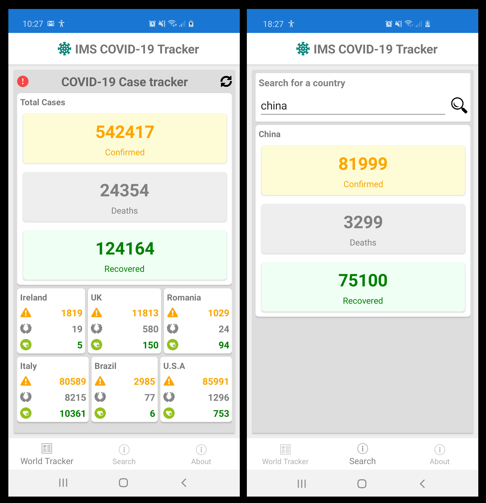

# IMS COVID-19 Tracker
This is a simple COVID-19 Tracker mobile app available for iOS and Android

# Installation

[Click here to install the App](https://appcenter.ms/orgs/imsmaxims/applications)

Once clicked:

  1. Sign into the Micrsoft App center with your company credentials and then choose **IMS COVID-19 Tracker for Android or iOS**.
  2. Click the 'download' arrow icon next to the latest release
  3. A QR code will appear in a new window
  4. Take a picture of this with your mobile device

You should now be able to download the app directly onto your mobile

# Release Notes
  - **1.0.0** - First Release
  - **1.0.1** 
    - Fix bug where query for U.S.A provinces were incomplete
    - Change Death icon to something more sensitive
  - **1.0.2** 
    - Added auto-complete on search page
    - Fix bug in country search
  - **2.0.0** 
    - Include dynamic versioning in About page
    - Make main page country panels as editable widgets
  - **2.0.1** 
    - Fix collection bug on refresh
  - **2.0.2** 
    - Fix bug where widget values do not update properly
  - **2.0.3** 
    - Swipe left in a widget to display it bigger in a second page
    - Reset search criteria when leaving Search Page
  - **2.0.4** 
    - Bug fix where search box would crash app sometimes
  - **2.0.5** 
    - Fix small flickering when poping a page (Android only)
  - **2.1.0** 
    - More data and statistics being displayed
    - Added Donut Chart and Bar Chart on Widget Detail view
    - Added small tutorial toast to explain widget usage
    - Add "help" button to display widget tutorial
    - Add Sources information in the About page
    - Get total population, population per country and new calculation on deaths per million
  - **2.1.1** 
    - Fix bug where the population for US is wrong
  - **2.1.2** 
    - Fix population bugs and improve population by country API.